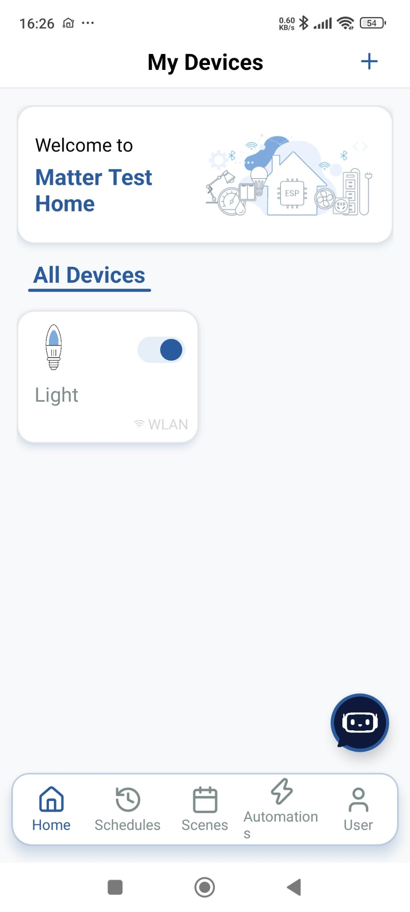
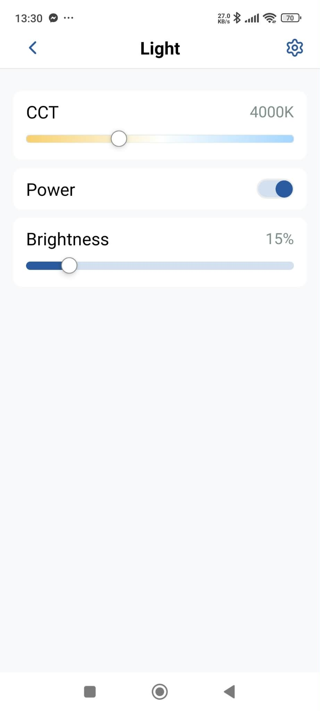
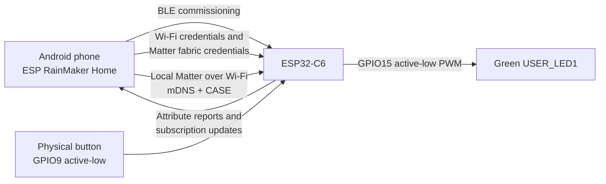
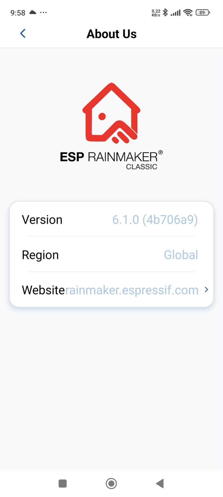

# Matter-over-Wi-Fi light on OLIMEX ESP32-C6-DevKit-Lipo

This guide documents a complete, tested Matter development setup for the
[OLIMEX ESP32-C6-DevKit-Lipo](https://www.olimex.com/Products/IoT/ESP32-C6/ESP32-C6-DevKit-Lipo/open-source-hardware).
It builds Espressif's Matter light example, adapts it to the board's real user
LED, commissions it from an Android phone, and controls its power and brightness
from ESP RainMaker Home.

The finished project provides:

- Matter commissioning over Bluetooth Low Energy;
- operational Matter communication over 2.4 GHz Wi-Fi;
- On/Off control of the board's green user LED;
- brightness control using PWM;
- state toggling with the physical user button, reported back to the app; and
- local control from an Android phone running ESP RainMaker Home.





## What Matter is and what it can be used with

Matter is an IP-based smart-home application protocol. It standardizes how a
controller discovers, commissions, secures, describes, and controls a device.
It is not another radio system: it runs over IP networks carried by Wi-Fi,
Ethernet, or Thread. Bluetooth Low Energy is normally used to simplify initial
setup, rather than for everyday Matter control.

The same Matter data model can represent products such as lights and switches,
plugs, door locks, thermostats and other HVAC controls, blinds and shades,
sensors, bridges, media devices, appliances, energy-management equipment, and
other supported smart-home device types. A bridge can also expose compatible
non-Matter products, such as some Zigbee or Z-Wave devices, to a Matter fabric.
The exact device types available depend on the Matter version implemented by
both the product and its controller.

Matter is intended to reduce ecosystem lock-in. Compatible products can be
used with Matter-capable platforms such as Amazon Alexa, Apple Home, Google
Home, Samsung SmartThings, vendor applications, and independent controllers.
Support still depends on each platform's Matter version and device-type
implementation; a Matter logo does not mean every optional feature appears in
every application. Matter's Multi-Admin feature can place one device on more
than one ecosystem/fabric, so the same device can be controlled from multiple
platforms when all participants support the required flow.

Control is primarily local and secured within a Matter fabric. Remote control
normally requires an always-on, internet-connected Matter controller or hub in
the home. This distinction matters in this demonstration because the Android
phone itself is the local controller; without a separate hub, it must be on the
same LAN as the ESP32-C6.

For terminology and currently supported categories, see the Connectivity
Standards Alliance's [Matter FAQ](https://csa-iot.org/all-solutions/matter/matter-faq/)
and [overview of Matter devices, fabrics, commissioners, controllers, and bridges](https://csa-iot.org/newsroom/peeking-under-the-hood-of-your-matter-smart-home/).

In this project, Bluetooth is used only for initial commissioning. During that
process, the phone authenticates the ESP32-C6, gives it Wi-Fi credentials, and
installs Matter operational credentials. Normal control then moves to the local
Wi-Fi network and uses secure Matter sessions plus mDNS discovery. State also
travels in the opposite direction: pressing the physical button changes the
Matter On/Off attribute, and the subscribed Android application updates its
switch after a short propagation delay.



After commissioning, the board normally stops being discoverable as a new BLE
device. That is expected. It reconnects directly to Wi-Fi and advertises an
operational `_matter._tcp` service instead.

## Tested configuration

| Item | Version or setting used |
| --- | --- |
| Board | OLIMEX ESP32-C6-DevKit-Lipo, Rev. A |
| Module | ESP32-C6-MINI-1-N4, 4 MB SPI flash |
| Observed silicon revision | ESP32-C6 revision v0.1 |
| Host OS | Ubuntu-family Linux; commands are suitable for Ubuntu 22.04/24.04 |
| ESP-IDF | `v5.5.5` |
| ESP-Matter | `release/v1.6` |
| Matter transport | BLE commissioning, Matter over 2.4 GHz Wi-Fi |
| Android application | ESP RainMaker Home, package `com.espressif.novahome` |
| RainMaker configuration | Classic backend, Global region |
| Application version tested | `6.1.0 (4b706a9)` |
| Example | `esp-matter/examples/light` |
| Matter endpoint | Endpoint 1, light |
| User LED | GPIO15, ordinary green LED, active LOW |
| User button | GPIO9, active LOW |

Commissioning credentials and setup payloads are intentionally not included in
this public guide. Use the QR code or manual pairing code generated by your own
firmware/build and printed by the device during startup. Do not publish Wi-Fi
credentials, production passcodes, private keys, device-attestation keys, or
other per-device secrets in a repository or screenshot.

## Hardware requirements

- OLIMEX ESP32-C6-DevKit-Lipo;
- USB-C data cable connected to either the CH340 serial connector or the native
  USB/JTAG connector;
- Linux PC with internet access;
- Android phone with Bluetooth and Wi-Fi;
- 2.4 GHz Wi-Fi access point; and
- phone and board on the same local network during normal control.

The router must allow devices on the WLAN to communicate with each other.
Disable AP/client isolation and permit IPv6 multicast and mDNS.

## Host resource requirements

The machine used for this test had approximately 16 GB RAM and the following
free-space situation before installation:

```text
/dev/sda2       115G   79G   31G  73% /
```

The 31 GB free space was sufficient. ESP-IDF, ESP-Matter, Matter dependencies,
host tools, and build output can consume roughly 15-22 GB. Retain at least
8-10 GB free if possible.

Check before starting:

```bash
df -h /
free -h
```

This guide uses shallow clones, installs ESP-IDF tools only for ESP32-C6, and
does not require Docker, VS Code, or another IDE.

## 1. Install Linux packages

```bash
sudo apt update

sudo apt install -y \
  git wget flex bison gperf \
  python3 python3-pip python3-venv python3-dev \
  cmake ninja-build ccache \
  gcc g++ pkg-config \
  libffi-dev libssl-dev libdbus-1-dev libevent-dev \
  libglib2.0-dev libavahi-client-dev \
  libgirepository1.0-dev libcairo2-dev libreadline-dev \
  libusb-1.0-0 dfu-util unzip
```

Optionally clear old APT package downloads:

```bash
sudo apt clean
df -h /
```

Allow the current user to access USB serial devices:

```bash
sudo usermod -aG dialout "$USER"
```

Log out and back in after changing group membership. For an SSH session,
disconnect and reconnect.

## 2. Install ESP-IDF v5.5.5

```bash
mkdir -p ~/esp
cd ~/esp

git clone \
  --branch v5.5.5 \
  --depth 1 \
  --recursive \
  --shallow-submodules \
  https://github.com/espressif/esp-idf.git

cd ~/esp/esp-idf
./install.sh esp32c6
source ~/esp/esp-idf/export.sh

idf.py --version
```

Expected version:

```text
ESP-IDF v5.5.5
```

Official setup reference:
[ESP-IDF v5.5.5 Linux/macOS setup](https://docs.espressif.com/projects/esp-idf/en/v5.5.5/esp32c6/get-started/linux-macos-setup.html).

## 3. Verify the basic toolchain with Hello World

Do this before installing Matter. It separates USB and ESP-IDF problems from
Matter-specific problems.

```bash
cd ~/esp
cp -r ~/esp/esp-idf/examples/get-started/hello_world .
cd ~/esp/hello_world

idf.py set-target esp32c6
idf.py build
```

Connect the board and locate its serial port:

```bash
ls -l /dev/ttyUSB* /dev/ttyACM* 2>/dev/null
```

Typical mappings are:

- CH340 USB-to-serial connector: `/dev/ttyUSB0`
- native USB/JTAG connector: `/dev/ttyACM0`

Select the port that actually appeared:

```bash
PORT=/dev/ttyUSB0
# Or: PORT=/dev/ttyACM0

idf.py -p "$PORT" flash monitor
```

Exit the monitor with `Ctrl+]`.

The test is successful when the board prints `Hello world!` and repeatedly
restarts. A warning like the following means the binary was configured for
2 MB while the physical board has 4 MB:

```text
Detected size(4096k) larger than the size in the binary image header(2048k)
```

It is not a hardware failure. The Matter project is configured for 4 MB later.

## 4. Install ESP-Matter release/v1.6

```bash
source ~/esp/esp-idf/export.sh

cd ~/esp

git clone \
  --branch release/v1.6 \
  --single-branch \
  --depth 1 \
  https://github.com/espressif/esp-matter.git

cd ~/esp/esp-matter
git submodule update --init --depth 1

cd ~/esp/esp-matter/connectedhomeip/connectedhomeip
./scripts/checkout_submodules.py \
  --platform esp32 linux \
  --shallow

cd ~/esp/esp-matter
./install.sh
```

The installation can take a long time. Check its exit status immediately:

```bash
echo "INSTALL EXIT STATUS: $?"
```

The required result is `0`.

The command above is the path used for this project and includes the Linux
host tools, including CHIP Tool. If disk space is especially limited and the
Android application will be the only controller, ESP-Matter also supports:

```bash
./install.sh --no-host-tool
```

That smaller alternative was not used for the documented test and omits the
optional CHIP Tool workflow in section 14.

Check storage afterward:

```bash
df -h /
du -sh ~/esp ~/.espressif 2>/dev/null
```

Official source:
[ESP-Matter release/v1.6](https://github.com/espressif/esp-matter/tree/release/v1.6).

## 5. Activate the development environment

Run these commands in every new terminal:

```bash
source ~/esp/esp-idf/export.sh
source ~/esp/esp-matter/export.sh
export IDF_CCACHE_ENABLE=1

# Explicitly select ESP32-C6 board support. This must be set after export.sh.
export ESP_MATTER_DEVICE_PATH="$HOME/esp/esp-matter/device_hal/device/esp32c6_devkit_c"
```

Verify the paths:

```bash
echo "$IDF_PATH"
echo "$ESP_MATTER_PATH"
echo "$ESP_MATTER_DEVICE_PATH"
```

Expected values resemble:

```text
/home/USERNAME/esp/esp-idf
/home/USERNAME/esp/esp-matter
/home/USERNAME/esp/esp-matter/device_hal/device/esp32c6_devkit_c
```

The explicit `ESP_MATTER_DEVICE_PATH` prevents CMake from accidentally loading
the original ESP32 board support. Without it, the build may incorrectly stop
with:

```text
please set esp32 as the IDF_TARGET using 'idf.py set-target esp32'
```

Do not follow that suggestion for this board. It means the wrong device
directory was selected, not that the project should target ESP32.

## 6. Adapt the example to the OLIMEX LED

The stock ESP32-C6 light example targets an Espressif board with a WS2812 RGB
LED on GPIO8. The OLIMEX board instead has an ordinary green LED named
`USER_LED1` on GPIO15. The schematic and OLIMEX example software establish
that it is active LOW.

The GPIO driver supports On/Off and PWM brightness, which is exactly what the
physical OLIMEX LED needs.

Back up the two files:

```bash
cd ~/esp/esp-matter

cp device_hal/device/esp32c6_devkit_c/device.c \
   device_hal/device/esp32c6_devkit_c/device.c.before-olimex-led

cp device_hal/device/esp32c6_devkit_c/esp_matter_device.cmake \
   device_hal/device/esp32c6_devkit_c/esp_matter_device.cmake.before-olimex-led
```

Apply the changes:

```bash
# GPIO8 -> GPIO15
sed -i \
  's/#define LED_GPIO_PIN GPIO_NUM_8/#define LED_GPIO_PIN GPIO_NUM_15/' \
  device_hal/device/esp32c6_devkit_c/device.c

# Add active-low output inversion. Run this command only once.
sed -i \
  '/\.channel = LED_CHANNEL,/a\        .output_invert = true,' \
  device_hal/device/esp32c6_devkit_c/device.c

# WS2812 driver -> ordinary GPIO/PWM driver
sed -i \
  's/SET(led_type        ws2812)/SET(led_type        gpio)/' \
  device_hal/device/esp32c6_devkit_c/esp_matter_device.cmake
```

Verify the result:

```bash
grep -n 'LED_GPIO_PIN\|output_invert' \
  ~/esp/esp-matter/device_hal/device/esp32c6_devkit_c/device.c

grep -n 'led_type' \
  ~/esp/esp-matter/device_hal/device/esp32c6_devkit_c/esp_matter_device.cmake
```

The important values must be:

```text
#define LED_GPIO_PIN GPIO_NUM_15
.output_invert = true,
SET(led_type        gpio)
```

The same changes are recorded in
[`patches/olimex-esp32-c6-devkit-lipo-led.patch`](patches/olimex-esp32-c6-devkit-lipo-led.patch).

## 7. Configure and build the Matter light

```bash
source ~/esp/esp-idf/export.sh
source ~/esp/esp-matter/export.sh
export ESP_MATTER_DEVICE_PATH="$HOME/esp/esp-matter/device_hal/device/esp32c6_devkit_c"

cd ~/esp/esp-matter/examples/light

idf.py set-target esp32c6
idf.py menuconfig
```

In `menuconfig`, select:

```text
Serial flasher config
  -> Flash size
    -> 4 MB
```

Save and exit, then build:

```bash
idf.py build
```

After modifying the driver on an already configured project, use:

```bash
idf.py fullclean
idf.py build
```

The `fullclean` command preserves `sdkconfig`; it removes generated build output,
not the flash contents of the board.

## 8. Flash and monitor

For a new or previously unrelated board image, erase the flash once:

```bash
cd ~/esp/esp-matter/examples/light

PORT=/dev/ttyUSB0
# Or: PORT=/dev/ttyACM0

idf.py -p "$PORT" erase-flash
idf.py -p "$PORT" flash monitor
```

If the device is already commissioned and only the application binary has been
rebuilt, do **not** erase the flash. Preserve NVS, Wi-Fi credentials, and Matter
fabrics with:

```bash
idf.py -p "$PORT" flash monitor
```

For the adapted firmware, startup must contain:

```text
Project name: light
led_driver_gpio: Initializing light driver
Light created with endpoint_id 1
```

It must not say `led_driver_ws2812`.

Before first commissioning it should also print:

```text
CHIPoBLE advertising started
Commissioning window opened
```

## 9. Prepare ESP RainMaker Home on Android

The successful test did **not** use the current ESP RainMaker Home release from
Google Play. It used an older Android build that had been retained separately.
The tested package and version were:

```text
com.espressif.novahome
ESP RainMaker Classic
Version 6.1.0 (4b706a9)
Region Global
```



Use that exact known-good APK if reproducing this test. Obtain it only from a
trusted source, verify the package name and version after installation, and do
not treat arbitrary third-party APK download sites as trustworthy. A newer
marketplace release may have a different onboarding flow or may not reproduce
the behavior documented here. This is a record of the tested compatibility,
not a recommendation to disable Android security checks.

When prompted, select the **Classic** backend and **Global** region. Matter was
tested in the Classic deployment.

Before commissioning:

1. Connect the phone to the same 2.4 GHz Wi-Fi network intended for the board.
2. Enable Bluetooth.
3. Enable Location if required by the Android version.
4. Grant Nearby Devices, Bluetooth, and Location permissions.
5. Keep the phone near the ESP32-C6.
6. Create and select a Home in RainMaker, for example `Matter Test Home`.

Creating/selecting a Home first is important because RainMaker must associate
the Matter fabric with a group. An uninitialized Home can produce errors such
as `convertToMatterFabric not available on current adaptor or group`.

## 10. Commission the Matter light

In ESP RainMaker Home:

1. Open the selected Home.
2. Tap **Add Device**.
3. Select **Matter Pairing Code**.
4. Do not select the generic RainMaker Bluetooth option that scans for
   `PROV_` devices.
5. Enter the manual pairing code generated by your build/device, or scan its
   generated Matter QR code. Do not copy a setup code from this repository.
6. Select/confirm the 2.4 GHz Wi-Fi network.
7. Enter the Wi-Fi password when requested.
8. Keep the app open until the process completes.

Watch the serial log throughout the process. Successful commissioning includes:

```text
BLE GAP connection established
Commissioning session started
connected with YOUR_WIFI_SSID
IP_EVENT_STA_GOT_IP
Fabric is committed
Commissioning completed successfully
Commissioning complete
```

In the tested RainMaker flow, two fabrics were visible in the device log:

```text
Fabric index 0x1 ... VendorId 0x6006
Fabric index 0x2 ... VendorId 0x131B
```

The flow first used the Android/Google commissioning fabric and then committed
the RainMaker fabric. Some Android screens displayed generic errors during
unsuccessful attempts. The decisive indicators are the serial log, both fabrics
being committed, and the device card appearing in RainMaker.

If commissioning fails, save both the complete application error and the serial
output from the same attempt before erasing anything.

## 11. Test the finished device

Open the `Light` card in RainMaker:

- Power toggles the green LED.
- Brightness changes its PWM duty cycle.
- The physical user button toggles the same Matter On/Off state locally.
- After a short network/subscription delay, RainMaker receives the attribute
  report and moves its Power switch to match the new board state.

This is deliberately two-way. The application can command the board, while a
physical action on the board is reported back to the application. A brief delay
is normal because the change must be processed, reported over Matter, and then
rendered by the Android application.

The user interface may expose CCT/color-temperature controls because the stock
example describes a more capable light endpoint. A single green LED cannot
change its color temperature, so that control has no meaningful physical
effect. Power and brightness are the useful controls for this hardware.

## 12. Expected behavior after reboot

A commissioned reboot should show:

```text
Fabric index 0x1 was retrieved from storage
Fabric index 0x2 was retrieved from storage
connected with YOUR_WIFI_SSID
Fabric already commissioned. Disabling BLE advertisement
mDNS service published: _matter._tcp
IP_EVENT_STA_GOT_IP
```

The absence of BLE discovery is correct at this stage. The board is no longer a
new device waiting to be commissioned.

## Expected serial-log checkpoints

The timestamps, addresses, node identifiers, and event numbers will differ on
every device and run. The following shortened, sanitized excerpts are based on
the logs captured during this project. They show the useful checkpoints without
publishing the original network or device identifiers.

### First boot before commissioning

```text
app_init: Project name:     light
app_init: ESP-IDF:          v5.5.5
led_driver_gpio: Initializing light driver
button: IoT Button Version: 4.2.1
app_main: Light created with endpoint_id 1
chip[DIS]: mDNS service published: _matterc._udp
chip[DL]: CHIPoBLE advertising started
app_main: Commissioning window opened
```

`_matterc._udp`, BLE advertising, and an open commissioning window indicate
that the uncommissioned board is ready to be added. If the driver says
`led_driver_ws2812` instead of `led_driver_gpio`, the OLIMEX GPIO adaptation was
not included in the binary.

### Wi-Fi connection and successful commissioning

```text
wifi:connected with <YOUR_SSID>
chip[DL]: IP_EVENT_STA_GOT_IP
chip[DL]: IPv4 Internet connectivity ESTABLISHED
chip[DIS]: mDNS service published: _matter._tcp
chip[FS]: GeneralCommissioning: Received CommissioningComplete
chip[FP]: Metadata for Fabric <index> persisted to storage.
app_main: Fabric is committed
chip[SVR]: Commissioning completed successfully
app_main: Commissioning complete
esp_matter_core: Commissioning Complete
app_main: Commissioning window closed
```

The important transition is from the commissionable `_matterc._udp` service to
the operational `_matter._tcp` service, followed by the fabric being persisted
and commissioning completing successfully.

### Brightness command and state report

Moving the brightness slider produced messages of this form:

```text
chip[EM]: ... IM:InvokeCommandRequest
esp_matter_command: Received command 0x00000004 for endpoint 0x0001's cluster 0x00000008
chip[ZCL]: RX level-control: MOVE_TO_LEVEL_WITH_ON_OFF ...
chip[ZCL]: Setting on/off to ON due to level change
chip[EM]: ... IM:InvokeCommandResponse
chip[EM]: ... IM:ReportData
chip[IM]: Received status response, status is 0x00
```

Endpoint `0x0001` is the light and cluster `0x00000008` is Level Control. The
`ReportData` exchange is also the mechanism used to deliver changed attributes
to a subscribed controller. When the onboard button changes the On/Off
attribute, RainMaker receives the new state and updates its switch after a
short delay; not every button press produces a friendly `button pressed` line.

### Normal reboot after commissioning

```text
chip[FP]: Fabric index <index> was retrieved from storage.
wifi:connected with <YOUR_SSID>
chip[SVR]: Fabric already commissioned. Disabling BLE advertisement
chip[SVR]: Server Listening...
chip[DIS]: mDNS service published: _matter._tcp
chip[SVR]: Server initialization complete
chip[DL]: BLE deinit successful and memory reclaimed
chip[DL]: IP_EVENT_STA_GOT_IP
chip[DL]: IPv4 Internet connectivity ESTABLISHED
```

This means the saved fabric and Wi-Fi information survived the restart. The
device intentionally does not return to BLE commissioning mode.

## 13. Local-network limitation

This build is a pure Matter example, not a RainMaker-cloud-enabled firmware.
The Android phone acts as its local controller. The phone and ESP32-C6 therefore
must be connected to the same local Wi-Fi network for direct control.

If the phone accidentally switches to mobile data, the card may remain visible
but commands will stop reaching the board. The device log can then show message
retransmissions, a torn-down subscription, and mDNS resolution timeouts. That
does not mean the ESP32 went to sleep.

Reconnect the phone to the same Wi-Fi network and reopen RainMaker. For reliable
remote access or unattended automation, add an always-on compatible Matter
controller/hub.

## 14. Optional CHIP Tool verification

CHIP Tool is not required for the Android commissioning path, but it is useful
for protocol debugging and automated testing.

After a successful ESP-Matter installation, check for it with:

```bash
find ~/esp/esp-matter/connectedhomeip/connectedhomeip/out/host \
  -maxdepth 2 \
  -type f \
  -name chip-tool \
  -ls
```

A typical path is:

```text
~/esp/esp-matter/connectedhomeip/connectedhomeip/out/host/chip-tool
```

CHIP Tool uses its own Matter fabric. It cannot automatically control a device
that belongs only to the Android/RainMaker fabrics. Multi-admin/fabric sharing
or fresh commissioning is required.

## Troubleshooting

### `pw: command not found` and no `chip-tool`

If installation ended with errors such as:

```text
activate.sh: pw: command not found
pop_var_context: head of shell_variables not a function context
chip-tool: No such file or directory
```

start a fresh terminal and repair only the generated Matter environment:

```bash
sudo apt update
sudo apt install -y libevent-dev

source ~/esp/esp-idf/export.sh

cd ~/esp/esp-matter/connectedhomeip/connectedhomeip

# Safety check before removing the generated environment.
test "$(pwd -P)" = "$HOME/esp/esp-matter/connectedhomeip/connectedhomeip" || exit 1

rm -rf -- .environment

cd ~/esp/esp-matter
./install.sh
echo "INSTALL EXIT STATUS: $?"
```

Close the terminal, open a new one, and verify:

```bash
source ~/esp/esp-idf/export.sh
source ~/esp/esp-matter/export.sh

command -v pw
ls -l ~/esp/esp-matter/connectedhomeip/connectedhomeip/out/host/chip-tool
```

Do not delete ESP-IDF or the whole ESP-Matter checkout for this repair.

### Build selects `device_hal/device/esp32_devkit_c`

Symptom:

```text
please set esp32 as the IDF_TARGET using 'idf.py set-target esp32'
```

Fix the board-support path after sourcing the environment:

```bash
export ESP_MATTER_DEVICE_PATH="$HOME/esp/esp-matter/device_hal/device/esp32c6_devkit_c"

cd ~/esp/esp-matter/examples/light
idf.py fullclean
idf.py build
```

### LED does not react but Matter commands arrive

If startup says:

```text
led_driver_ws2812: Initializing light driver
```

the firmware still uses the Espressif WS2812 configuration. Repeat the GPIO15,
active-low, and GPIO-driver modifications in section 6, then run `fullclean`,
build, and flash without erasing NVS.

### Device is no longer discoverable over Bluetooth

Check the serial log. If it says:

```text
Fabric already commissioned. Disabling BLE advertisement
```

the device is already commissioned. This is expected. Use it through the
existing controller instead of entering the pairing code again.

### Device appears offline after working earlier

Confirm that the phone did not switch to mobile data or another Wi-Fi network.
Then check the board's current IP address in the serial log and test it from the
Linux machine:

```bash
ping -c 4 BOARD_IP_ADDRESS
```

If available, inspect Matter mDNS advertisements:

```bash
avahi-browse -rt _matter._tcp
```

Also verify that the router has client isolation disabled.

### Benign or contextual log messages

These messages are not necessarily fatal:

```text
No suitable OTA Provider candidate found
The device does not support GetClock_RealTimeMS(); falling back...
WARNING: Writing to serial is timing out
Read request on unknown cluster
```

- No OTA provider simply means Matter OTA was not configured.
- The clock message uses Matter's stored Last Known Good Time.
- The serial warning concerns writes to an application without an interactive
  console; received logging can still work.
- Unknown cluster reads may be controller capability probes. Judge them in the
  context of whether commissioning and commands complete.

### Start over only when necessary

Erasing flash removes Wi-Fi credentials and all Matter fabrics:

```bash
cd ~/esp/esp-matter/examples/light
idf.py -p "$PORT" erase-flash
idf.py -p "$PORT" flash monitor
```

Use this only for a deliberate fresh commissioning attempt. A normal rebuild
or LED-driver update should use `flash monitor` without `erase-flash`.

## Security and production notes

This is a development demonstration:

- it uses a public setup passcode and discriminator;
- it uses development/test Matter credentials;
- it is not a certified commercial Matter product;
- the pairing code must not be reused for production; and
- production devices need unique commissioning data, device attestation
  credentials, secure manufacturing, and an appropriate certification path.

See Espressif's
[ESP-Matter production guide](https://docs.espressif.com/projects/esp-matter/en/latest/esp32/production.html)
and the Matter SDK documentation before designing a product.

## Useful links

- [OLIMEX ESP32-C6-DevKit-Lipo hardware and documentation](https://www.olimex.com/Products/IoT/ESP32-C6/ESP32-C6-DevKit-Lipo/open-source-hardware)
- [OLIMEX board repository](https://github.com/OLIMEX/ESP32-C6-DevKit-Lipo)
- [ESP-IDF v5.5.5 documentation](https://docs.espressif.com/projects/esp-idf/en/v5.5.5/esp32c6/)
- [ESP-Matter repository, release/v1.6](https://github.com/espressif/esp-matter/tree/release/v1.6)
- [ESP-Matter programming guide](https://docs.espressif.com/projects/esp-matter/en/latest/esp32c6/developing.html)
- [ESP RainMaker Home repository](https://github.com/espressif/esp-rainmaker-home)
- [RainMaker Matter fabric management](https://docs.rainmaker.espressif.com/docs/sdk/rainmaker-matter-sdk/FabricManagement/create-and-manage-fabrics/)

## Result

The final system successfully commissions the OLIMEX ESP32-C6-DevKit-Lipo as a
Matter light, restores its fabrics and Wi-Fi configuration after reboot, and
controls the onboard GPIO15 green LED from ESP RainMaker Home. Both power and
brightness are functional. The physical button can toggle the same Matter
state, and the Android switch follows the board's new state after a short delay.
